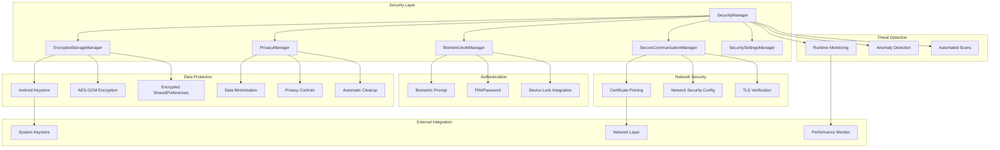
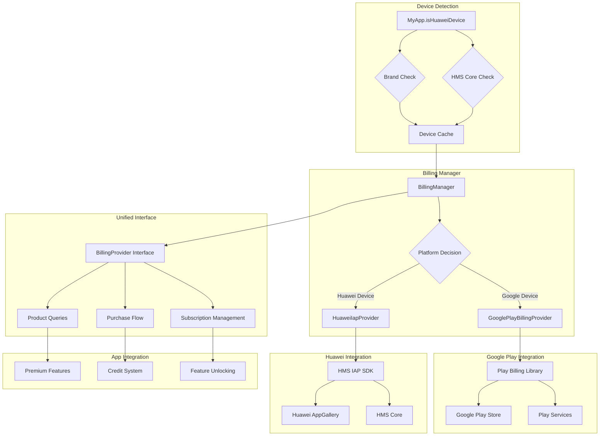
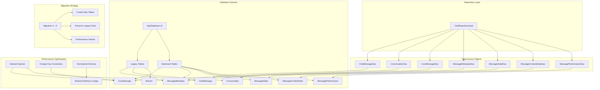
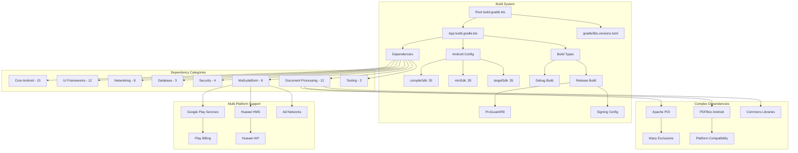

# DeepSeekChat4 Architecture Diagrams

## 1. Overall Application Architecture

```mermaid
graph TB
    subgraph "Presentation Layer"
        A[StartActivity] --> B[MainActivity]
        B --> C[AudioAiActivity]
        B --> D[ImageGenerationActivity]
        B --> E[SettingsActivity]
        
        F[HomeFragment]
        G[HistoryFragment]
        H[SavedConversationsFragment]
        
        I[ChatAdapter]
        J[ConversationAdapter]
        K[ModelSpinnerAdapter]
    end
    
    subgraph "Domain Layer"
        L[SendMessageUseCase]
        M[CreateConversationUseCase]
        N[GetConversationsUseCase]
        O[StreamingUseCase]
    end
    
    subgraph "Data Layer"
        P[ChatRepository]
        Q[AppDatabase]
        R[RetrofitInstance]
        S[StreamingHandler]
        
        Q --> T[ChatMessageDao]
        Q --> U[ConversationDao]
        Q --> V[CoreMessageDao]
        Q --> W[MessageMetadataDao]
    end
    
    subgraph "Core Services"
        X[BillingManager]
        Y[SecurityManager]
        Z[AdManager]
        AA[UnifiedStreamingManager]
        BB[ThemeManager]
    end
    
    subgraph "External APIs"
        CC[AIML API]
        DD[Together AI]
        EE[Google APIs]
        FF[Huawei HMS]
    end
    
    B --> F
    B --> G
    B --> H
    
    I --> L
    J --> M
    
    L --> P
    M --> P
    N --> P
    O --> P
    
    P --> Q
    P --> R
    R --> S
    
    X --> FF
    X --> EE
    Y --> BB
    
    R --> CC
    R --> DD
    R --> EE
    
    MyApp[MyApp] --> X
    MyApp --> Y
    MyApp --> Z
    MyApp --> AA
    MyApp --> BB
```



## 2. Security Architecture



## 3. Billing & Multi-Platform Architecture



## 4. AI Chat Flow Architecture

```mermaid
sequenceDiagram
    participant U as User
    participant MA as MainActivity
    participant CA as ChatAdapter
    participant SM as SendMessageUseCase
    parameter CR as ChatRepository
    participant SH as StreamingHandler
    participant API as AI API
    participant DB as AppDatabase
    
    U->>MA: Type message
    MA->>CA: Add user message
    CA->>DB: Store user message
    
    MA->>SM: Send message request
    SM->>CR: Process message
    CR->>SH: Start streaming
    
    SH->>API: HTTP POST (streaming)
    API-->>SH: Stream chunks
    
    loop Streaming Response
        SH->>CA: Update partial content
        CA->>MA: Display streaming text
        MA->>U: Show real-time response
    end
    
    SH->>DB: Store complete message
    SH->>CA: Mark streaming complete
    CA->>MA: Enable user input
```

## 5. Data Layer Architecture



## 6. Dependency & Build Architecture



These diagrams provide a comprehensive visual overview of the DeepSeekChat4 application architecture, showing the relationships between different layers, components, and external dependencies.